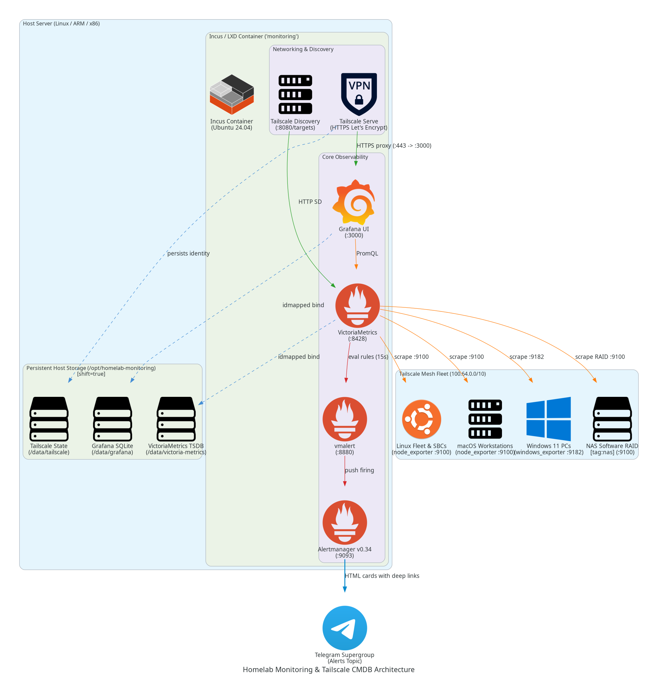
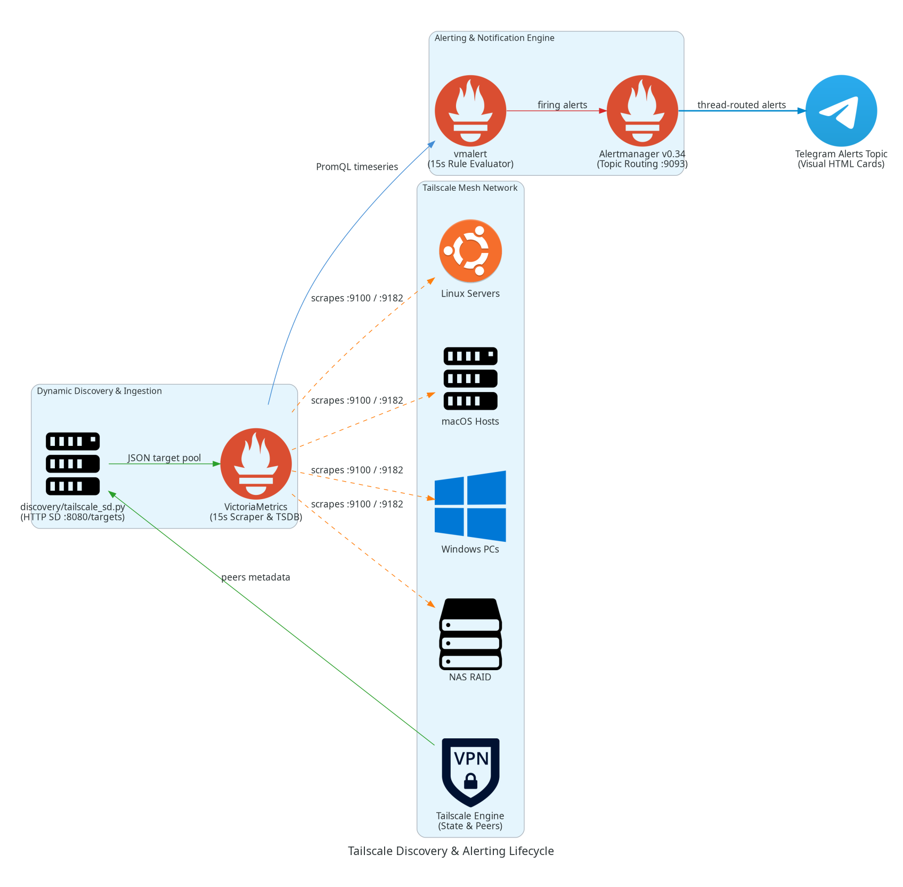
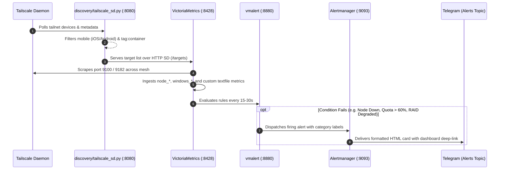
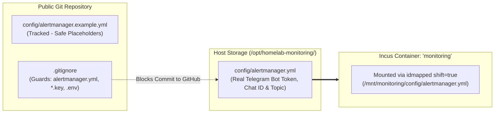

# Homelab Monitoring, Alerting & Tailscale CMDB Stack

An opinionated, high-performance, and ultra-lean monitoring, alerting, and CMDB stack built for mixed homelab fleets and Tailscale networks.

Powered by **Incus / LXD**, **VictoriaMetrics**, **Grafana**, **vmalert**, **Alertmanager**, and **Dynamic Tailscale Discovery**.

---

## Architecture Overview

<p align="center">
  
</p>

<details>
<summary><b>View Mermaid Architecture Code</b></summary>


</details>

---

## Key Highlights

- **Cattle Container, Pet Data**: The container is completely disposable. All time-series data, Grafana users, Alertmanager state, and Tailscale machine keys reside directly on the host filesystem (`/opt/homelab-monitoring`) with zero uid/gid permission mismatch (`shift=true`).
- **VictoriaMetrics Core**: Replaces heavy Prometheus instances with single-binary VictoriaMetrics. Uses ~120MB RAM, starts in milliseconds, natively scrapes Prometheus targets, and is 100% PromQL compatible.
- **Dynamic Tailscale Discovery**: Automatically queries your tailnet and feeds active nodes to VictoriaMetrics over HTTP Service Discovery (`http_sd_configs`). Automatically detects offline infrastructure nodes for immediate downtime alerting while filtering out phones and auxiliary containers.
- **Automated Telegram Alerting**: Dispatches structured HTML alert cards with visual ASCII depletion bars, severity badges, and one-tap deep links directly to dedicated Telegram forum topics (via Alertmanager v0.34+ `message_thread_id`).
- **Browser-Trusted HTTPS via Tailscale Serve**: Automatically acquires and renews official Let's Encrypt certificates for `https://monitoring.<your-tailnet>.ts.net` with zero reverse-proxy boilerplate.
- **Cross-Platform Fleet CMDB**: Unifies Linux, macOS, and Windows 11 hardware, OS, and network telemetry into an executive asset inventory table.

---

## Service Discovery & Data Pipeline

<p align="center">
  
</p>

<details>
<summary><b>View Sequence Flowchart Code</b></summary>



</details>

---

## Included Dashboards

The stack auto-provisions 4 comprehensive dashboards located in `dashboards/`:

1. **`tailscale-cmdb.json` (Tailscale Homelab CMDB)**:
   - Centralized asset directory coalescing Linux/macOS `node_*` and Windows `windows_*` metrics.
   - Shows hostname, Tailscale IP, OS version, kernel, CPU cores, physical RAM, disk utilization, uptime, and scrape health in a unified searchable grid.
2. **`nas-raid-storage.json` (NAS & RAID Storage)**:
   - Built for software RAID arrays (e.g. `md0`, `md1` via `mdadm`).
   - Dynamically filters on nodes carrying `tag:nas`.
   - Real-time array integrity stat cards (`HEALTHY` vs `DEGRADED`), active/failed disk counters, rebuild/sync progress gauges, filesystem space breakdown (Used vs Free), and physical member drive read/write IOPS and latency.
3. **`agent-observability.json` (AI Gateway & Quota Observability)**:
   - Tracks LiteLLM proxy spend, model latency percentiles, and error rates.
   - Live quota tracking for Antigravity (`agy`) and OpenCode remaining quota percentages across `5h`, `Weekly`, and `Monthly` windows.
4. **`node-exporter-full.json` (Deep System Telemetry)**:
   - Deep OS and kernel metrics covering CPU frequency, thermal sensors, memory allocation, TCP connections, and disk saturation.

---

## Alerting Rules & Golden Signals

Pre-configured in `config/alerts/`:

| Rule Name | Group | Severity | Condition |
|---|---|---|---|
| `TailscaleNodeDown` | `fleet_availability` | 🔥 Critical | Node unreachable for > 3m (`up{job="tailscale-nodes"} == 0`) |
| `DiskWillFillIn24Hours` | `host_hardware` | ⚠️ Warning | Linear regression predicts root disk fills in < 24h (`predict_linear < 0`) |
| `HostMemoryExhaustion` | `host_hardware` | 🔥 Critical | Usable RAM drops below 5% for > 5m (`MemAvailable / MemTotal < 0.05`) |
| `SBCThermalOverheat` | `host_hardware` | ⚠️ Warning | Sensor exceeds 82°C for > 5m (protects ARM boards like ODROID/Rockchip) |
| `RAIDArrayDegraded` | `host_hardware` | 🔥 Critical | Software RAID array has dropped or failed drives (`node_md_degraded > 0`) |
| `RAIDDiskFailed` | `host_hardware` | 🔥 Critical | mdadm reports failed disk in array (`node_md_disks{state="failed"} > 0`) |
| `LiteLLMHighErrorRate` | `ai_gateway` | 🔥 Critical | > 10% of agent requests fail over 5m |
| `AgentLatencyDegraded` | `ai_gateway` | ⚠️ Warning | p90 agent response latency exceeds 25s |
| `AIMetricsCollectorStale`| `ai_gateway` | ⚠️ Warning | `ai_metrics.prom` textfile not updated for > 10m |
| `OpenCodeQuota60PercentUsed`| `opencode_quota` | ⚠️ Warning | Remaining quota between 30% and 40% (60% used) |
| `OpenCodeQuota70PercentUsed`| `opencode_quota` | ⚠️ Warning | Remaining quota between 20% and 30% (70% used) |
| `OpenCodeQuota80PercentUsed`| `opencode_quota` | ⚠️ Warning | Remaining quota between 10% and 20% (80% used) |
| `OpenCodeQuota90PercentUsed`| `opencode_quota` | 🔥 Critical | Remaining quota between 0% and 10% (90% used) |
| `OpenCodeQuotaExhausted`| `opencode_quota` | 🔥 Critical | Remaining quota completely exhausted (`remaining == 0`) |

---

## Secrets Management & Git Safety

This repository eliminates the need for complex external secret managers or encryption tools by adopting a **Host-Bound Secrets Pattern**:



### How Secrets are Protected:
1. **Zero Secret Footprint in Git**:
   The repository only tracks `config/alertmanager.example.yml` with generic placeholders (`YOUR_TELEGRAM_BOT_TOKEN`, `chat_id: 123456789`).
2. **Guarded by `.gitignore`**:
   The real production file (`config/alertmanager.yml`) is explicitly blocked by `.gitignore` and can never be accidentally staged or committed to git.
3. **Persists across Re-deploys**:
   Because the configuration resides on the host storage at `/opt/homelab-monitoring/config/`, destroying or upgrading the container with `teardown.sh` and `deploy.sh` preserves your credentials automatically without manual intervention.

---

## Quickstart & Deployment

### 1. Prerequisites
- Linux host running Ubuntu 22.04/24.04 or Debian 12 (x86_64 or ARM64).
- Incus or LXD installed (`deploy.sh` auto-installs Incus if missing).
- Tailscale account with MagicDNS enabled.

### 2. Deploy
```bash
git clone https://github.com/StaticVish/homelab-monitoring.git
cd homelab-monitoring

# Provide an optional Tailscale Auth Key for zero-touch joining:
# export TAILSCALE_AUTHKEY="tskey-auth-..."

sudo ./deploy.sh
```

The script will:
1. Initialize persistent host storage at `/opt/homelab-monitoring/`.
2. Configure UFW bridge routing for `incusbr0`.
3. Launch an Ubuntu 24.04 container named `monitoring` with idmapped shifting (`shift=true`).
4. Install VictoriaMetrics, vmalert, Alertmanager v0.34.0, Grafana, and Tailscale SD.
5. Authenticate to Tailscale and activate **Tailscale HTTPS Serve**.
6. Provide a valid HTTPS MagicDNS URL: `https://monitoring.<your-tailnet>.ts.net`.

### 3. Teardown & Rebuild
Because the container is treated as cattle and all state is kept on the host:
```bash
# Safely destroy the container (zero data loss):
sudo ./teardown.sh

# Re-deploy in seconds:
sudo ./deploy.sh
```

---

## Installing Exporters across the Fleet

### Multi-OS Ansible Playbook
Automatically maps Linux, macOS, and Windows architecture:
```bash
cd external-exporters/ansible
ansible-playbook --become-user root --ask-pass --ask-become-pass -i inventory playbook.yaml
```

### Standalone Platform Installers
- **Linux** (Systemd): `sudo ./external-exporters/install-linux.sh`
- **macOS** (LaunchDaemon + Application Firewall whitelist): `sudo ./external-exporters/install-macos.sh`
- **Windows 11** (MSI + Windows Firewall rule for `100.64.0.0/10`):
  ```powershell
  Set-ExecutionPolicy Bypass -Scope Process -Force
  .\external-exporters\install-windows.ps1
  ```

---

## License

Open-source software licensed under the [MIT License](LICENSE).
